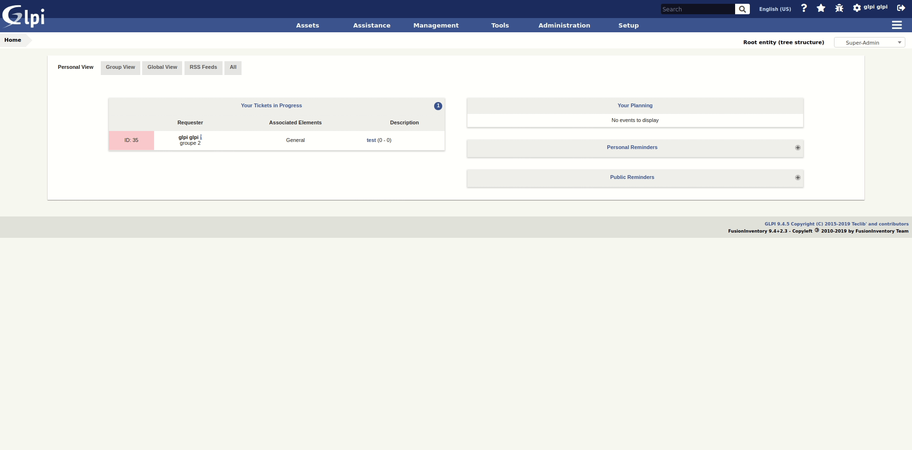
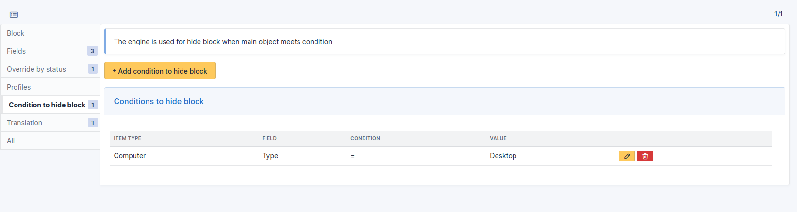
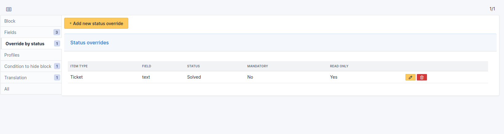
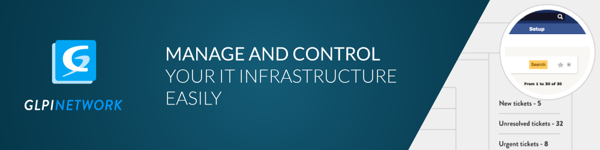

# Fields GLPI plugin

The fields plugin allows you to add custom fields on GLPI items forms.

Additionnal data can be added:
 * In object tab
 * In main form of object, above save button
 * In form of a tab, above save button

Supported GLPI items are listed on below, see [Supported GLPI items](#Supported-GLPI-items)

Possible fields type are:
 * Header (title bloc)
 * Text (single line)
 * Text (multiple lines)
 * Number
 * URL
 * Custom dropdown (always a tree dropdown)
 * Yes / No
 * Date
 * Date / Hour
 * GLPI item dropdown based on a single item type, see [Supported GLPI items](#Supported-GLPI-items)
 * GLPI item dropdown based on a multiple item types, see [Supported GLPI items](#Supported-GLPI-items)

## Supported GLPI items

Following list contains GLPI item types that are handled by this plugin.
These item types will be available to attach field containers to, and will be usable in GLPI item dropdowns fields.

    
Click to expand list

* Assets
    * Computers
    * Monitors
    * Software
    * Network devices
    * Devices
    * Printers
    * Cartridge models
    * Consumable models
    * Phones
    * Racks
    * Enclosures
    * PDUs
    * Passive devices
    * Cables
* Assistance
    * Tickets
    * Problems
    * Changes
    * Recurrent tickets
    * Recurrent changes
    * External events
* Management
    * Licenses
    * Versions
    * Budgets
    * Suppliers
    * Contacts
    * Contract
    * Documents
    * Lines
    * Certificates
    * Data centers
    * Clusters
    * Domains
    * Appliances
    * Databases
    * Database instances
* Tools
    * Projects
    * Project tasks
    * Reminders
    * RSS feed
* Administration
    * Users
    * Groups
    * Entities
    * Profiles
* Components
    * Batteries
    * Cameras
    * Cases
    * Controllers
    * Drives
    * Firmware
    * Generic devices
    * Graphics cards
    * Hard drives
    * Memories
    * System boards
    * Network cards
    * PCI devices
    * Power supplies
    * Processors
    * Sensors
    * Simcards
    * Soundcards
* Dropdowns: Common
    * Locations
    * Statuses of items
    * Manufacturers
    * Blacklists
    * Blacklisted mail content
* Dropdowns: Assistance
    * ITIL categories
    * Task categories
    * Task templates
    * Solution types
    * Solution templates
    * Request sources
    * Followup templates
    * Project states
    * Project types
    * Project tasks types
    * Project task templates
    * External events templates
    * Event categories
    * Pending reasons
* Dropdowns: Types
    * Computer types
    * Networking equipment types
    * Printer types
    * Monitor types
    * Devices types
    * Phone types
    * License types
    * Cartridge types
    * Consumable types
    * Contract types
    * Contact types
    * Generic types
    * Sensor types
    * Memory types
    * Third party types
    * Interface types (Hard drive...)
    * Case types
    * Phone power supply types
    * File systems
    * Certificate types
    * Budget types
    * Simcard types
    * Line types
    * Rack types
    * PDU types
    * Passive device types
    * Cluster types
    * Database instance types
* Dropdowns: Models
    * Computer models
    * Networking equipment models
    * Printer models
    * Monitor models
    * Peripheral models
    * Phone models
    * Device camera models
    * Device case models
    * Device control models
    * Device drive models
    * Device generic models
    * Device graphic card models
    * Device hard drive models
    * Device memory models
    * System board models
    * Network card models
    * Other component models
    * Device power supply models
    * Device processor models
    * Device sound card models
    * Device sensor models
    * Rack models
    * Enclosure models
    * PDU models
    * Passive device models
* Dropdowns: Virtual machines
    * Virtualization systems
    * Virtualization models
    * States of the virtual machine
* Dropdowns: Management
    * Document headings
    * Document types
    * Business criticities
* Dropdowns: Tools
    * Knowledge base categories
* Dropdowns: Calendar
    * Calendars
    * Close times
* Dropdowns: Operating systems
    * Operating systems
    * Versions of the operating systems
    * Service packs
    * Operating system architectures
    * Editions
    * Kernels
    * Kernel versions
    * Update Sources
* Dropdowns: Networking
    * Network interfaces
    * Networks
    * Network port types
    * VLANs
    * Line operators
    * Domain types
    * Domains relations
    * Records types
    * Fiber types
* Dropdowns: Cable management
    * Cable types
    * Cable strands
    * Socket models
* Dropdowns: Internet
    * IP networks
    * Internet domains
    * Wifi networks
    * Network names
* Dropdowns: Software
    * Software categories
* Dropdowns: User
    * Users titles
    * User categories
* Dropdowns: Authorizations assignment rules
    * LDAP criteria
* Dropdowns: Fields unicity
    * Ignored values for the unicity
* Dropdowns: External authentications
    * Fields storage of the login in the HTTP request
* Dropdowns: Power management
    * Plugs
* Dropdowns: Appliances
    * Appliance types
    * Appliance environments
* Dropdowns: Camera
    * Image formats
* Dropdowns: Others
    * USB vendors
    * PCI vendors
* Other
    * Network ports
    * Notifications
    * Notification templates

## New features

The block can be hidden according to conditions. These are defined by rules evaluating main item properties.

Fields options (mandatory / read only) can be overridden for some item statuses.

## Download

Releases can be donwloaded on [GitHub](https://github.com/PluginsGLPI/fields/releases).

## Documentation

We maintain a detailed [documentation](http://glpi-plugins.rtfd.io/en/latest/fields/index.html).

## Contact

For notices about major changes and general discussion of fields, subscribe to the [/r/glpi](https://www.reddit.com/r/glpi/) subreddit.
You can also chat with us via [@glpi on Telegram](https://t.me/glpien).

## Professional Services

The GLPI Network services are available through our [Partner's Network](http://www.teclib-edition.com/en/partners/).
We provide special training, bug fixes with editor subscription, contributions for new features, and more.

Obtain a personalized service experience, associated with benefits and opportunities.

## Contributing

* Open a ticket for each bug/feature so it can be discussed
* Follow [development guidelines](http://glpi-developer-documentation.readthedocs.io/en/latest/plugins/index.html)
* Refer to [GitFlow](http://git-flow.readthedocs.io/) process for branching
* Work on a new branch on your own fork
* Open a PR that will be reviewed by a developer

## Copying

* **Code**: you can redistribute it and/or modify it under the terms of the GNU General Public License ([GPL-2.0](https://www.gnu.org/licenses/gpl-2.0.en.html)).
