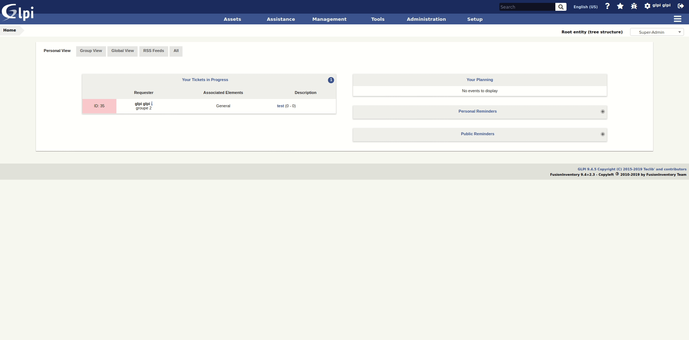
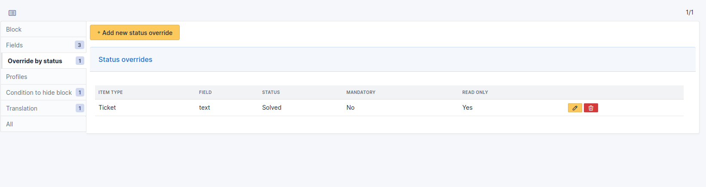

# Fields GLPI plugin

The fields plugin allows you to add custom fields on glpi types : tickets, computers, users...

Addionnal data can be added :
 * In object tab
 * In main form of object, above save button
 * In form of a tab, above save button

Possible fields type are :
 * Header (title bloc)
 * Text (single line)
 * Text (multiple lines)
 * Number
 * URL
 * Dropdown (always a tree dropdown)
 * Yes / No
 * Date
 * Date / Hour
 * Glpi item (itemtype items_id)
 * Glpi object (dropdown)
    * 

        
Click to expand list

            * Asset
                * Computers
                * Monitors
                * Network devices
                * Phones
                * Printers
                * Licenses
                * Certificates
                * Enclosures
                * PDUs
                * Lines
                * Racks
                * Clusters
                * Contracts
                * Appliances
                * Databases instances
                * Cables
            * Model
                * Computer models
                * Moniotr models
                * Network equipment models
                * Phone models
                * Enclosure models
                * PDU models
                * Rack models
            * Type
                * Computer types
                * Moniotr types
                * Network equipment types
                * Devices types
                * Phone types
                * Printer types
                * Database instance types
            * Component
                * Battery
                * Camera
                * Case
                * Control
                * Drive
                * Firmware
                * Generic
                * Graphic Card
                * HardDrive
                * Memory
                * Network Card
                * Pci
                * Power Supply
                * Processor
                * Sensor
                * Simcard
                * SoundCard
                * Motherboard
            * Administration
                * Users
                * Groups
            * Other
                * Operating systems
        

The block can be hidden according to conditions (rules on the value of the fields of the main object)

Fields option (mandatory / read only) can be overrides according to conditions (rules on status value of the main object)

## Download

* Download : https://github.com/PluginsGLPI/fields/releases

## Documentation

We maintain a detailed documentation here -> [Documentation](http://glpi-plugins.rtfd.io/en/latest/fields/index.html)

## Contact

For notices about major changes and general discussion of fields, subscribe to the [/r/glpi](https://www.reddit.com/r/glpi/) subreddit.
You can also chat with us via IRC in [#glpi on freenode](http://webchat.freenode.net/?channels=glpi) or [@glpi on Telegram](https://t.me/glpien).

## Professional Services

The GLPI Network services are available through our [Partner's Network](http://www.teclib-edition.com/en/partners/). We provide special training, bug fixes with editor subscription, contributions for new features, and more.

Obtain a personalized service experience, associated with benefits and opportunities.

## Contributing

* Open a ticket for each bug/feature so it can be discussed
* Follow [development guidelines](http://glpi-developer-documentation.readthedocs.io/en/latest/plugins/index.html)
* Refer to [GitFlow](http://git-flow.readthedocs.io/) process for branching
* Work on a new branch on your own fork
* Open a PR that will be reviewed by a developer

## Copying

* **Code**: you can redistribute it and/or modify
    it under the terms of the GNU General Public License ([GPL-2.0](https://www.gnu.org/licenses/gpl-2.0.en.html)).
